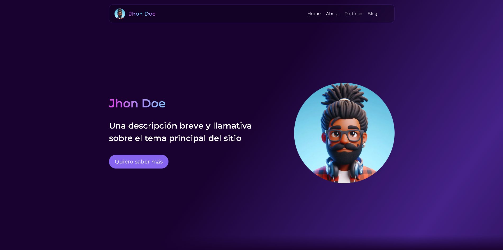

### start using this template by running:
 `npm create astro@latest -- --template SofiDevO/portfolio-sofidev-garrux`
# Portfolio Template with Astro

Welcome to the Portfolio Template built with Astro! This responsive template allows you to showcase all your projects with an amazing UI. Below you'll find instructions on how to use this template, including how to add new portfolio items, main dependencies, and examples of usage.


## Table of Contents

1. [Usage](#usage)
2. [Portfolio Data Format](#portfolio-data-format)
3. [Adding Icons with Iconify](#adding-icons-with-iconify)
4. [Technologies Used](#technologies-used)
5. [Figma Design](#figma-design)
6. [Author and License](#author-and-license)
7. [Bugs and Issues](#bugs-and-issues)
8. [Homepage](#homepage)

## Usage

To add new elements to your portfolio, you need to add them in `/src/data/portfolioData.js`.

## Portfolio Data Format

The data for your portfolio should follow this format:

```js
/**
 * @typedef PortfolioData
 * @property {string} imgSrc - URL of the image
 * @property {string} title - Title of the card
 * @property {string[]} skills - Array of your skills, e.g., ['React', 'CSS', 'JavaScript']
 * @property {string} description - Description of the card
 * @property {string} demoURL - URL of a demo page
 * @property {string} repoURL - URL of the repository, e.g., https://github.com/user/repo
 * @property {string} anim - Animation that will play when the card loads, e.g., fade-up, fade-right, fade-left, fade-down
 * @property {number} averageBrightness - Brightness level of the card's background color, e.g., 0.1
 */

/**
 * @type {PortfolioData[]}
 */
export const portfolioData = [
    {
        imgSrc: 'https://dt2sdf0db8zob.cloudfront.net/wp-content/uploads/2021/06/copy-of-the-6-best-restaurant-website-templates-1.png',
        title: 'Restaurant',
        skills: ['React', 'StyledComponents'],
        description: 'Laboris ex laboris mollit esse fugiat aute cillum nostrud enim dolor sit. Reprehenderit et non nulla irure aute nostrud commodo aute.',
        demoURL: '',
        repoURL: '',
        anim: 'fade-right',
    },
    {
        imgSrc: 'https://fiverr-res.cloudinary.com/images/q_auto,f_auto/gigs/299377097/original/7eb7dcebe244fcf5ad75d92b0969fc116946bd57/create-professional-amd-responsive-wordpress-website.jpg',
        title: 'E-commerce',
        skills: ['JavaScript', 'Bootstrap'],
        description: 'Laboris ex laboris mollit esse fugiat aute cillum nostrud enim dolor sit. Reprehenderit et non nulla irure aute nostrud commodo aute.',
        demoURL: '',
        repoURL: '',
        anim: 'fade-up',
        averageBrightness: 0.1,
    },
    // Add more portfolio items here
];

const skillIcons = {
    JavaScript: 'skill-icons:javascript',
    React: 'skill-icons:react-dark',
    Astro: 'skill-icons:astro',
    CSS: 'skill-icons:css',
    Sass: 'skill-icons:sass',
    StyledComponents: 'skill-icons:styledcomponents',
    Bootstrap: 'skill-icons:bootstrap',
    Tailwind: 'skill-icons:tailwindcss-dark',
};

/**
 * @description Maps portfolioData to include skill icons
 */
export const getPortfolioData = portfolioData.map((item) => ({
    ...item,
    skills: item.skills.map((skill) => skillIcons[skill]),
}));
```


> [!NOTE]
> For skills Icons you may use Garrux library [https://github.com/Garruxx/ascii-icons](https://github.com/Garruxx/ascii-icons)

This data is then passed to the portfolio component as props.

## Adding Icons with Iconify

We use Iconify for icons. To add new icons, use the `icon` attribute.

### Example

To use a React icon:

```html
<iconify-icon icon="logos:react" width="27" height="27"></iconify-icon>
```

In `data.js`, specify the icon identifier like this:

```js
{
    title: "React",
    link: "https://reactjs.org/",
    icon: "logos:react"
}
```

### Adding the Iconify Script

Add the Iconify script to the `<head>` section of your project:

```html
<head>
    <script src="https://code.iconify.design/iconify-icon/2.1.0/iconify-icon.min.js"></script>
</head>
```

Once this script is included, you can use any Iconify icon by specifying its identifier.

## Technologies Used

This template leverages several modern technologies to create a highly responsive and visually appealing portfolio:

- **Astro**: A modern static site builder that allows you to use your favorite frameworks such as React, Vue, and Svelte. It optimizes for performance by shipping less JavaScript.
- **React**: A JavaScript library for building user interfaces, which allows for the creation of reusable components.
- **Tailwind CSS**: A utility-first CSS framework that enables you to design directly in your markup, providing flexibility and control over your styling.
- **Styled Components**: A library for React and React Native that allows you to use component-level styles in your application. It utilizes tagged template literals to style components.
- **Iconify**: A comprehensive library for icons that provides access to thousands of icons from different collections, all accessible via a single syntax.

## Figma Design

You can view and edit the design of this template on Figma. Here is the [Figma design link](https://www.figma.com/design/15EteAKw8d0QCNCucw5lft/mi-primer-blog?node-id=200-643&t=hbUqn1hqSfLcfI92-0).

## Author and License

- **Author**: SofiDev / Garrux
- **License**: MIT

## Bugs and Issues

If you encounter any bugs or have issues, please report them [here](https://github.com/SofiDevO/portfolio-astrosofidev-garrux/issues).

## Homepage

For more information and detailed documentation, visit the [homepage](https://github.com/SofiDevO/portfolio-astrosofidev-garrux#readme).

---

Enjoy building your portfolio! If you have any questions or run into any issues, feel free to reach out.
